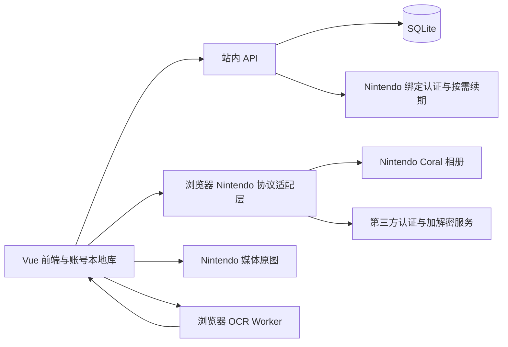

# Groove Archive · FP 成绩管理三期设计文档

> 版本：v3.1 草案
>
> 调研日期：2026-09-29；修订日期：2026-09-30
>
> 状态：方案设计，尚未实现或连接真实 Nintendo 账号验证
>
> 目标：项目账号登录、多设备成绩同步、Nintendo 绑定、访问时由前端读取相册、下载截图并 OCR

## 1. 结论与实施建议

三期采用**访问时触发＋前端相册读取＋前端截图下载＋前端 OCR**。保留现有 Vue 前端和离线能力，新增 Node.js / TypeScript API 与 SQLite，负责站内登录、Nintendo 绑定认证、成绩存储及多设备同步。

执行链路为：**用户访问页面 → 前端读取 Nintendo Switch App 云端相册 → 筛选未处理的 GCFP 截图 → 前端下载原图并 OCR → 后端校验、合并和保存成绩 → 各设备同步**。相册列表响应和截图字节均不经过本项目后端；后端仅接收处理元数据、结构化候选与成绩操作。

站内账号拥有成绩，Nintendo 绑定是可选来源。后端可承担绑定时的身份验证和按需短期凭据签发，但不执行相册扫描、图片下载、图片存储或 OCR。页面关闭、退出登录或被浏览器挂起时不保证继续处理；已提交成绩保留，未完成图片下次访问重试。

nxapi 作为认证及协议参考，NSO-Album-Sync 作为授权、下载与去重参考。不能直接将 nxapi 的 Node.js 库视为可在普通网页运行的 SDK。浏览器直连的跨域、请求头和第三方加解密能力是实施前提，具体阻碍和验证见第 2.5、13.1 节。

三期拆为三个可独立验收的交付：

1. **3A：站内账号与成绩同步**，不依赖 Nintendo 服务
2. **3B：Nintendo 绑定与前端手动读取、下载、OCR、预览确认**，验证完整客户端链路
3. **3C：访问时自动触发、严格自动入库、待确认和断点恢复**，不引入服务器定时轮询

本次按用户确认的执行边界修订，不把后端代理相册、代理截图或服务端 OCR 作为隐含备选。普通网页直连不成立时，3A 继续交付，相册能力保持待验证；客户端扩展或本地桥接需另行明确产品形态。

## 2. 已确认的能力与边界

### 2.1 主机与云端相册

任天堂官方说明：Switch 2 可将截图上传到 Nintendo Switch App，也可在主机相册设置中启用自动上传；云端每个 Nintendo Account 最多保存 100 个文件，上传内容保存 30 天，部分软件不支持上传。离线时可排队等待联网上传。[官方上传说明](https://www.nintendo.com/en-gb/Support/Troubleshooting/How-to-Upload-Screenshots-and-Videos-from-Nintendo-Switch-2-to-the-Nintendo-Switch-App-2843767.html)

由此确定产品边界：

| 场景                                | 三期行为                                                       |
| ----------------------------------- | -------------------------------------------------------------- |
| Switch 2、截图已出现在官方 App 相册 | 可尝试自动读取；GCFP 的真实截图上传和识别仍须验证              |
| 只保存在主机或存储卡、没有上传      | 未上传的截图不在可读取的云端相册内                                             |
| 原版 Switch / Lite / OLED           | 不纳入本方案的云端相册自动读取承诺；继续导出截图后使用现有 OCR |
| 超过云端可见窗口、已过期的文件      | 无法通过这些接口补回，用户需重新上传或手动导入                 |
| 上传到了其他 Nintendo 用户下        | 跳过读取                                                       |
| 视频、非 GCFP 图片                  | 不下载视频、不识别无关游戏截图                                 |

访问时更新只能读取当时仍可见的云端内容。长期未访问或短时间上传大量其他游戏内容可能漏图；此功能不作为相册备份，关页后不更新。

### 2.2 两个项目的具体复用方式

本次按以下提交核查源码，实施时应固定通过验证的版本，不能把浮动 `main` 当作稳定接口：

| 项目                                                                                                     | 核查提交                                   | 能力与定位                                                                                    |
| -------------------------------------------------------------------------------------------------------- | ------------------------------------------ | --------------------------------------------------------------------------------------------- |
| [nxapi](https://github.com/samuelthomas2774/nxapi/tree/47c9d35d9d51d33e62dd6d3733b616e0ad31b02b)         | `47c9d35d9d51d33e62dd6d3733b616e0ad31b02b` | TypeScript/JavaScript 库、CLI、桌面应用；可创建 Coral 会话、刷新认证、读取相册                |
| [NSO-Album-Sync](https://github.com/Dycool/NSO-Album-Sync/tree/4fc49154aa984b85e0c5d3f67a977021a81274b7) | `4fc49154aa984b85e0c5d3f67a977021a81274b7` | C++20 原生桌面托盘应用；授权、定期下载、文件归档与系统凭据存储，README 默认同步周期为 60 分钟 |

nxapi 的 `package.json` 在核查提交声明 `1.6.1`，这不证明 npm 同名版本已经包含该提交的全部改动。PoC 必须核对实际安装包是否具有相册与当前加密协议支持。[包声明](https://github.com/samuelthomas2774/nxapi/blob/47c9d35d9d51d33e62dd6d3733b616e0ad31b02b/package.json)

已核实的 nxapi 能力：

| 能力     | 源码 / 文档中的入口                    | 接入注意                                          |
| -------- | -------------------------------------- | ------------------------------------------------- |
| 初次认证 | `CoralApi.createWithSessionToken(...)` | 返回 `nso` 与认证 `data`                          |
| 恢复会话 | `CoralApi.createWithSavedToken(data)`  | 保存并复用认证数据，不应每次访问重新登录          |
| 续期     | `renewToken(...)` / `onTokenExpired`   | 持久化更新后的凭据，以当前类型及返回值为准        |
| 相册列表 | `nso.getMedia()`                       | 底层调用 `/v4/Media/List`，库返回值中读取 `media` |
| CLI 验证 | `nxapi nso album --json`               | 适合个人 PoC，不作为正式后端每次请求的子进程      |

依据：[Coral 库说明](https://github.com/samuelthomas2774/nxapi/blob/47c9d35d9d51d33e62dd6d3733b616e0ad31b02b/docs/lib/coral.md)、[Coral 实现](https://github.com/samuelthomas2774/nxapi/blob/47c9d35d9d51d33e62dd6d3733b616e0ad31b02b/src/api/coral.ts)、[相册 CLI](https://github.com/samuelthomas2774/nxapi/blob/47c9d35d9d51d33e62dd6d3733b616e0ad31b02b/src/cli/nso/album.ts)

相册媒体模型包含 `id`、`type`、`applicationId`、`appName`、`contentUri`、`contentLength`、`thumbnailUri`、`capturedAt`、`uploadedAt`、`expiresAt`。`type` 区分 `image` 和 `video`；缩略图类型注释为 320×180 JPEG，不能代替 OCR 原图。时间由适配层从上游秒统一转换为本项目毫秒。[媒体类型定义](https://github.com/samuelthomas2774/nxapi/blob/47c9d35d9d51d33e62dd6d3733b616e0ad31b02b/src/api/coral-types.ts#L513)

当前 `getMedia()` 没有暴露分页游标；虽然类型文件保留 `count: 100` 的参数声明，实际调用没有传该字段。NSO-Album-Sync 当前也发送空 `parameter`。设计为扫描当前可见集合，不虚构分页、历史回溯或服务端增量能力。[相册调用实现](https://github.com/Dycool/NSO-Album-Sync/blob/4fc49154aa984b85e0c5d3f67a977021a81274b7/src/coral.cpp#L661)

NSO-Album-Sync 值得参考的是：缓存凭据、校验下载地址与长度、临时文件完成后再改名、保留拍摄时间。其单用户状态、系统钥匙串和桌面回调不能直接套用到托管后端。[同步实现](https://github.com/Dycool/NSO-Album-Sync/blob/4fc49154aa984b85e0c5d3f67a977021a81274b7/src/sync.cpp)

### 2.3 外部认证依赖不是一个普通 Bearer API

当前源码包含第三方 `f` 生成，以及 Coral 请求加密和响应解密。NSO-Album-Sync 的 README 明确披露，相关服务会处理 Nintendo 身份信息、Coral token 和 API 请求/响应。不能只告诉用户“第三方收到一个临时签名参数”，也不能声称凭据始终只在用户设备或本项目服务器内。[数据披露](https://github.com/Dycool/NSO-Album-Sync/blob/4fc49154aa984b85e0c5d3f67a977021a81274b7/README.md#-nintendo-account--nxapi)、[nxapi 加密请求实现](https://github.com/samuelthomas2774/nxapi/blob/47c9d35d9d51d33e62dd6d3733b616e0ad31b02b/src/api/coral.ts#L828)

nxapi 文档要求库调用者注册自己的 nxapi-auth client，常见作用域为 `ca:gf ca:er ca:dr`；该凭据属于本项目接入第三方认证服务的身份，与 Nintendo 客户端 ID、站内用户会话不同。不可复制其他应用的 client 身份或依赖其私人代理。[nxapi 认证说明](https://github.com/samuelthomas2774/nxapi#nxapi-auth-authentication)

NSO-Album-Sync 的当前 Coral 源码还存在作者部署的 Worker `f` 生成路径。它不是项目可直接依赖的公共服务承诺，采用 nxapi 适配层时不照搬这条私有部署依赖。[Coral 源码](https://github.com/Dycool/NSO-Album-Sync/blob/4fc49154aa984b85e0c5d3f67a977021a81274b7/src/coral.cpp)

这些是非官方接口，更新可能导致授权或拉取失效。Nintendo 故障只影响绑定和相册任务，站内登录、成绩同步和手动导入应继续可用。

### 2.4 许可证与调研可信度

nxapi 声明 `AGPL-3.0-or-later`，NSO-Album-Sync 为 MIT。正式采用前确定本项目源码发布方式、依赖分发和通知要求；不能因为把 nxapi 放进独立进程，就假定解决所有许可问题。这里记录依赖条件，不作具体法律适用结论。[nxapi 许可证](https://github.com/samuelthomas2774/nxapi/blob/47c9d35d9d51d33e62dd6d3733b616e0ad31b02b/LICENSE)、[NSO-Album-Sync 许可证](https://github.com/Dycool/NSO-Album-Sync/blob/4fc49154aa984b85e0c5d3f67a977021a81274b7/LICENSE)

按项目要求先使用 Context7 CLI 查询了两个项目，但返回的是无关库，没有可用索引，因此本节以固定提交的源码和任天堂官方资料为依据。已确认代码能力与产品边界，并进行了无真实凭据的浏览器相册跨域测试；真实账号授权、服务额度、GCFP application ID 和媒体原图跨域仍未实测。

### 2.5 浏览器直连限制与当前验证结果

所核查的 nxapi Coral、Nintendo Account 和加解密源码依赖 `node:crypto`、`node:process`、`undici` 及 Buffer。这些入口是 Node 环境实现，需抽取协议并编写浏览器适配器，不能直接认为 npm 安装后即可网页调用。[Coral 源码](https://github.com/samuelthomas2774/nxapi/blob/47c9d35d9d51d33e62dd6d3733b616e0ad31b02b/src/api/coral.ts)、[加解密源码](https://github.com/samuelthomas2774/nxapi/blob/47c9d35d9d51d33e62dd6d3733b616e0ad31b02b/src/api/f.ts)

2026-09-30 对公开端点做无凭据 OPTIONS 探测，Origin 为 `http://127.0.0.1:5173`，拟请求方法 POST、请求头 authorization/content-type：

| 端点 | HTTP 状态 | 本次返回的 CORS 许可头 |
| --- | --- | --- |
| Nintendo `/v4/Media/List` | 200 | 未见 Access-Control-Allow-Origin/Methods/Headers |
| Nintendo Account `/connect/1.0.0/api/token` | 405 | 未见上述许可头 |
| nxapi-znca-api `/api/znca/encrypt-request` | 401 | 未见上述许可头 |

这些结果不能证明所有 Origin、授权路径均不支持跨域，但当前探测没有建立普通网页直连可行性；相册请求这一路预检尚不满足浏览器放行条件。第三方端点是否存在其他允许的浏览器路径和授权方式，需要向服务方核实并实测。

同日补充真实 Edge 154.0.4258.37 验证：使用实际本地 HTTP 页面 `http://127.0.0.1:10718`，不拦截或模拟网络响应，不关闭浏览器跨域安全检查。页面 fetch 相册接口，方法 POST，请求头为 Authorization 和 `Content-Type: application/octet-stream`，使用无效测试凭据；浏览器发出的 OPTIONS 返回 200、无跨域许可头，控制台明确报告预检失败，CDP 错误为 `PreflightMissingAllowOriginHeader`，JavaScript 得到 `TypeError: Failed to fetch`。

因此当前本地 Origin 下的相册预检失败已由浏览器确认，并非仅根据命令行响应推测。预检不携带实际 Authorization token，此次阻断发生在账号鉴权之前。正式网站 Origin、其他上游支持路径仍需验证；未取得真实媒体 URL，不能据此推断截图 CDN 的 CORS 同样失败。验证成功必须既通过预检，也能从实际响应读取列表 JSON，以及从媒体响应读取 Blob 并用于 Canvas/OCR。[MDN CORS 说明](https://developer.mozilla.org/en-US/docs/Web/HTTP/Guides/CORS)

Node polyfill 不会使上游响应自动增加 CORS 头；`no-cors` 返回的 opaque 响应也不能读取列表 JSON 或原图 Blob。浏览器无法任意设置的应用请求头同样需要检查。前端执行为目标架构，普通网页直接上线仍受这些硬条件限制，不以本次文档改动宣称问题已经解决。

## 3. 与现有项目衔接

以 [二期设计](FP_B30_二期设计文档.md) 和当前代码为基线；本文件只扩展三期范围，不将二期待实现功能视为已完成。

| 现有模块 | 当前行为 | 三期调整 |
| --- | --- | --- |
| `src/db/database.ts` | 单个 Dexie 数据库，本地数字自增 ID | 区分游客库和账号库，增加 outbox、游标、前端相册任务元数据 |
| `src/db/scoreRepository.ts` | 本地增删改，OCR 高分合并 | 保留页面入口；本地成绩与待同步操作在同一事务写入 |
| `src/core/score/import.ts` | Excel 预览及事务合并 | 抽取共用合并规则，新增 `nso_ocr` 来源 |
| `src/core/ocr/parser.ts` | 字段解析、曲名匹配、页面校验 | 复用并补充候选、证据和待确认结果 |
| `src/core/ocr/recognizer.ts` | 浏览器 Worker、Canvas、WASM | 继续在用户浏览器运行，与相册导入共用模型会话 |
| `src/core/rating/`、`src/core/song/` | 本地规则和稳定曲库 ID | 前后端共用版本；服务端校验并重算派生字段 |
| `src/composables/useOcrImport.ts` | 页面任务取消、前台入库 | 复用识别能力；账号相册队列由应用级前端控制器维护 |

继续遵守：Score 为 0～1,050,000 整数；FC / AP / Max Chain 可未知；AP 成立时 FC 成立；每用户每谱面一条当前成绩；BASIC / ADVANCED 独立 B30。只改 Max Chain 不改变业务 `updatedAt`，但必须触发同步版本变化。

现有 `rating` 为派生值，不能信任客户端上传结果。现有数字 `id` 仅用于设备内部，不作为跨设备主键。后端验证字段合法性、归属和合并规则，不证明前端识别结果或客户端上报的 mediaId 来自真实 Nintendo 截图；三期是个人成绩管理，来源标签不承担排行榜认证。

## 4. 范围与架构

### 4.1 最小部署与职责



图中的上游直连箭头表示目标执行边界，须通过第 13.1 节浏览器验证后才能作为可用实现。绑定认证与相册访问分开：后端可以建立和更新认证会话，后续相册请求由前端发出。

| 环节 | 执行位置 |
| --- | --- |
| 站内登录、Nintendo 绑定身份验证、长期凭据保护 | 后端 |
| 访问触发、相册请求构造、读取列表、筛选 | 前端 |
| 相册请求所需的第三方加解密调用 | 前端直接调用获授权服务，须验证跨域与短期授权方式 |
| 原图下载、尺寸检查、hash、OCR、预览 | 前端 |
| 成绩校验、事务合并、跨设备去重元数据和同步 | 后端 |
| 进度、重试、页面生命周期和模型释放 | 前端 |

一台服务器运行一个 API 进程和持久化数据库卷即可起步。静态前端与 `/api` 同源，SQLite 保存业务数据和处理元数据。写事务保持短小，不在事务中等待认证网络请求。多实例或持续写入压力出现后再评估 PostgreSQL。

移除相册调度进程、服务器任务执行队列、图片卷、无头 Chromium 和服务端 OCR 运行时。数据库中的处理租约仅协调客户端，不会唤醒服务器执行相册工作。清理过期记录属于轻量维护，不是定期读取 Nintendo 相册。

### 4.2 范围与页面生命周期

三期包含账号登录、游客迁移、多设备同步、离线编辑、绑定/解绑、访问时更新、手动更新、导入记录、待确认及错误恢复。

自动更新以用户访问为条件，默认不设置整天运行的相册轮询，也不使用 Service Worker 承诺关页后持续识别。应用内部切换成绩页、B30 或设置页可继续当前批次；切出网站后台时不启动新扫描，并允许正在执行的工作被暂停或中断。下一次可见访问恢复未完成任务。

好友、排行榜、完整游玩历史、相册备份、视频识别和服务端代操作主机不纳入。主题、语言继续设备本地保存。

## 5. 站内账号与设备隔离

### 5.1 登录方案

首版建议邮箱一次性验证码登录，省去密码找回和密码管理；邮箱服务是新增外部依赖，部署时配置发送服务和发信域名。若部署环境不适合邮件，3A 开工前替换为单一成熟身份提供方，成绩归属仍使用内部 `userId`，不与邮箱或第三方昵称绑定。

验证码仅存哈希，建议 10 分钟过期、一次有效、失败次数封顶；按邮箱和 IP 限制发送及验证频率，返回统一提示避免枚举账号。成功后发随机站内会话，数据库存会话摘要，浏览器使用 `HttpOnly + Secure + SameSite` Cookie。写请求校验 Origin 和 CSRF，账号切换及退出撤销当前会话。

站内会话、Nintendo 长期会话、Coral 短期凭据、nxapi-auth 应用凭据分开保存和命名。所有 API 从服务端会话确定 `userId`，不能信任请求体中用户自报的所有者。

### 5.2 游客迁移及退出

1. 首次登录先拉取云端快照，保留原游客数据
2. 若游客库有成绩，显示新增、可提升、同分补全、跳过数量，用户选择导入或暂不导入
3. 导入按第 7 节规则合并，整个迁移带唯一 `migrationId`，重复提交不能重复产生效果
4. 服务端确认后写入账号库；保留游客库作为迁移前副本，之后两者不自动双向同步
5. 退出后停止该账号的本地同步器并返回游客库；账号数据不作为游客数据显示

推荐每个账号独立 IndexedDB 命名空间，服务端 `userId` 映射只保存在站点本地；切换账号时先取消旧请求和订阅，晚到响应必须校验账号及会话代次。待同步操作始终绑定原账号，不能转发给下一个登录用户。退出时有未同步数据要提示并保留原账号队列；仅在用户明确选择后丢弃本机副本。

本地缓存清除与云端成绩清空拆成不同操作。清除本机缓存不会产生云端删除，云端清空需二次确认并走独立的同步协议。

## 6. 数据模型建议

以下是逻辑模型，不是已执行的数据库迁移。所有用户查询和唯一约束包含所有者；API 时间统一为 UTC 毫秒。

| 后端表 | 关键字段和约束 |
| --- | --- |
| `users` | id、规范化唯一邮箱、createdAt、datasetEpoch、nextChangeSeq |
| `login_codes / sessions` | 验证码/会话摘要、过期时间、失败计数、所属 userId |
| `scores` | userId + chartId 唯一；score、nullable fc/ap/maxChain、source、业务时间、revision、deletedAt、autoImportBlocked |
| `score_changes` | 用户内单调 seq、chartId、规范结果、revision、epoch、服务端变更时间 |
| `mutation_receipts` | userId + mutationId 唯一、请求摘要和结果；相同 ID 不同载荷拒绝 |
| `nintendo_bindings` | userId、NintendoAccountId、显示名、状态、同意版本、加密认证数据、keyVersion、generation |
| `nintendo_auth_flows` | flowId、userId、state、加密 verifier、过期和消费状态 |
| `album_scan_sessions` | bindingId、deviceId、epoch、generation、leaseId、leaseUntil、nextAllowedAt、最后成功检查时间、客户端上报摘要 |
| `album_items` | userId + NintendoAccountId + mediaId 唯一；客户端上报 applicationId、时间、内容 hash、终态、识别版本、候选、错误码和处理租约 |

后端不保存 contentUri、thumbnailUri、图片字节或图片文件引用。`album_items` 中的媒体描述由客户端上报，仅用于个人导入协调和去重，不是服务端亲自读取相册后的真实性证据。

账号本地 Dexie 库新增 `albumJobs` 和 `albumCandidates`，保存所属 userId、NintendoAccountId、mediaId、epoch、generation、阶段、重试时间及待提交结果。截图只在浏览器内存中处理，不持久化到 IndexedDB；需要重看时重新访问上游列表并下载。

`source` 扩充 `nso_ocr`。JSON 用 `null` 表示未知，不能将 false、0 当空值。编辑中字段缺失表示不修改，显式 null 表示清空。

`capturedAt` 是上游拍摄时间；`updatedAt` 维持现有业务语义；seq/revision 驱动同步。`lastCheckedAt` 与 `lastImportedAt` 分开，后者仅在成绩事务提交成功后更新。

首版每站内账号只绑定一个 Nintendo Account；同一个 Nintendo Account 不同时绑定多个站内账号。重新绑定同一 Nintendo Account 复用处理记录。

## 7. 成绩同步与冲突规则

### 7.1 传输协议

采用本地 outbox + 服务端变更日志，传输“操作”而非整库覆盖。操作含 `mutationId`、`deviceId`、`datasetEpoch`、chartId、动作、`baseRevision` 和业务字段；服务端事务内校验、写成绩、递增 seq、写变更及回执。

本地成绩和 outbox 在同一 Dexie 事务写入。一次最多提交 100 条操作；服务端逐操作返回成功、冲突或校验失败，网络超时后用原 mutationId 重试。客户端先拉取变化更新已确认基线，再把待提交操作叠加为本地视图，不能因拉取覆盖未上传编辑。

拉取使用不透明 cursor，返回按 seq 排序的 upsert 和 tombstone；应用变更与保存 cursor 是同一事务。首次快照返回一致性快照及对应 cursor。游标失效时下载新快照，保留 outbox，按原版本重新校验，禁止上传旧快照覆盖服务器。

首版登录、恢复联网、窗口重新可见时同步，页面可见期间建议每 30 秒拉取一次，有本地写入则短暂合并后立即提交。这里拉取的是本站成绩增量，不会触发 Nintendo 相册读取；相册仅按第 9.1 节的访问事件和冷却规则触发。

### 7.2 自动合并与显式编辑分开

| 操作                                | 规则                                                                       |
| ----------------------------------- | -------------------------------------------------------------------------- |
| 本地 OCR、Excel、游客迁移、相册 OCR | 高分更新、低分跳过；同分只补未知信息；不把低分 FC/AP 套在高分上            |
| 手动新增已有谱面                    | 延续当前提示，引导编辑；多设备并发新增返回冲突                             |
| 手动编辑，包括降分和清空字段        | 必须匹配 `baseRevision`，降分还需明确确认；冲突时显示当前云端值和本机提案  |
| 删除                                | 匹配 revision 后生成墓碑，不能物理删除后让离线旧设备重新插回               |
| 云端清空全部                        | 事务递增 datasetEpoch，并更新同步状态；旧 epoch 的操作整体拒绝，不逐条复活 |

并发自动导入可在服务端重新比较最新值，但不能越过人工保护、删除墓碑或 datasetEpoch。两台设备同时手动修改不同字段，首版也走版本冲突确认，不实现复杂字段级合并。

例如：A 离线将成绩编辑为 990000，B 已在云端纠错为 980000。A 的旧 revision 必须进入冲突，不能以“更高分”为理由覆盖 B。反过来，两张可信自动截图分别为 980000 和 990000，则最终保留 990000。

### 7.3 防止旧截图恢复错误数据

仅做“保留最高分”会使 OCR 误识别的高分在用户纠正后重新出现，因此规定：

- 人工降分、纠正已知完成标记或删除时，给该谱面设置 `autoImportBlocked`；后续自动候选进入待确认，用户可明确解除保护
- 已处理或用户拒绝的 mediaId 持续记录；重新上传相同字节以每用户内容 hash 去重，hash 命中原人工拒绝记录时仍待确认
- 编辑后的不同图片可能绕过 hash，所以保护必须作用于谱面，不只作用于文件
- 云端清空成绩会关闭访问时自动导入，保留媒体处理记录；用户重新开启时选择从当前可见列表建立基线，还是重新审核历史截图
- 任务在创建时保存 epoch 和 binding generation，最终写成绩时再次检查；清空、解绑或换账号后的旧任务不能提交

同步日志、墓碑和回执首版不自动淘汰，先保正确性并监控体积。后续压缩时必须定义最旧有效游标、设备失效及强制快照流程，不能仅按日期删除墓碑。

## 8. Nintendo 绑定与令牌生命周期

### 8.1 绑定与相册执行分开

两个参考项目使用原生应用认证流程：Nintendo 客户端为 `71b963c1b7b6d119`，回调为 `npf71b963c1b7b6d119://auth`，结果是 session_token_code，配合 state 与 S256 challenge。不能直接替换为本站 HTTPS callback。[授权实现](https://github.com/Dycool/NSO-Album-Sync/blob/4fc49154aa984b85e0c5d3f67a977021a81274b7/src/nintendo_auth.cpp)

建议先验证桌面浏览器引导式绑定：

1. 已登录用户同意第三方认证/加解密处理，以及浏览器获取短期会话凭据
2. 后端创建 10 分钟有效、一次使用的 flow，保存 state/verifier，返回授权链接
3. 用户在 Nintendo 官网登录；通过实测可用的方式复制原生回调，作为请求体提交本站
4. 后端检查 scheme、host、state、flow 所属会话和期限，交换 session token 并验证真实账号身份
5. 后端建立 Coral 认证会话，加密保存长期数据，完成绑定，清除 flow
6. 当前页面按需获取短期会话上下文，由前端执行第一次相册请求；空相册是合法结果

后端的认证请求不包含读取相册、转发相册列表或下载截图。登录回调能否复制，以及手机是否被官方 App 接管，仍须实测；不要求用户上传其他软件的凭据文件。

### 8.2 提供给前端的会话上下文

前端直接访问 Coral 需要可在浏览器使用的短期认证材料，不能继续沿用“所有 Nintendo 凭据永不进入浏览器”的描述。建议由后端按需续期并提供最小会话上下文：Coral 短期 token、到期时间、必要的协议标识、bindingId、generation；有需要时还包含第三方服务支持的受限短期授权。

Nintendo 长期 session token 和项目级 client secret 保留在后端，禁止打包到静态脚本。短期凭据仅驻留当前账号页面内存，退出或解绑时清除，不放入 localStorage、URL、日志和埋点。普通网页脚本持有 token 使其暴露面高于仅后端持有，实施时限制第三方脚本并落实页面注入防护。

第三方加解密服务必须提供适用于浏览器的调用方式和授权边界。不能用永久项目 secret 暴露给前端，也不能自行假定可以通过后端签发对方并不认可的 token；此项为第 13.1 节验证门槛。

### 8.3 续期、暂停与解绑

仅在页面访问且需要工作时获取或续期，闲置账号不后台刷新。按上游 expiresIn 复用有效会话；确认过期后最多续期一次再重试。每个绑定串行刷新，重复标签页复用有效结果。长期凭据失效进入 `reauth_required`，前端停止读取并提示重新绑定。

状态建议为 `active / paused / reauth_required / error / unbound`。暂停关闭访问时自动更新；退出停止当前批次并清除短期凭据；关闭页面后没有相册执行者。

解绑先递增 generation、撤销客户端处理租约，再删除长期认证数据。当前页面取消网络和 OCR、释放图片并清空短期上下文。其他设备旧上下文无法承诺立即在 Nintendo 侧失效，因此每次提交仍须校验 generation；任何已解绑批次都不能写成绩。已导入成绩保留。

## 9. 访问触发、前端下载与 OCR

### 9.1 触发规则和用户体验

登录且绑定 active 时，页面先显示本地/云端已有成绩，再异步检查相册，不阻塞首页和 B30。

- 首次进入网站，距离最近成功检查至少 5 分钟时自动检查一次
- 标签页重新可见时按相同 5 分钟冷却规则检查
- 页面内导航不重新检查；页面一直停留不周期轮询
- 提供“立即更新”，初始冷却为 60 秒；上游限流和既有退避优先
- 无新图片时不初始化 OCR；有图时显示发现数量、逐张进度与实际成绩更新数

5 分钟和 60 秒是本项目建议配置，不是上游允许额度。跨设备冷却与处理互斥由后端轻量元数据协调，只影响本项目客户端；不能将其视为对所有上游请求的强制管控。

用户长期未访问时不读取。当前云端容量和 30 天窗口内的图片仍可补读，已不可见图片需重新上传或手动导入；设置页说明该取舍。

### 9.2 相册读取和原图下载

1. 前端申请扫描许可，记录当前 userId、epoch、generation、deviceId 和 lease
2. 前端取得短期认证上下文，构造加密请求、直接调用 Coral 相册接口，并直接调用第三方解密服务
3. 前端校验响应模型，按 applicationId 白名单筛选 GCFP 的 image，跳过视频及其他游戏
4. 与本地及后端已处理 mediaId 对照，对新图片申请短期处理租约
5. 前端直接 fetch contentUri，读取 Blob，检查类型、长度、像素和内容 hash
6. 前端 OCR，保存结构化待提交结果，后端事务确认后将媒体标记 imported/skipped/needs_review

完整上游列表和图片均不转发至本站 API。服务端只接收选中媒体的必要描述、去重标识、候选及成绩，不实现 `/album/list`、图片下载代理或第三方加解密请求的中转。

GCFP applicationId 尚未验证，PoC 从真实媒体确认允许集合。`appName` 仅显示，不用模糊名称自动入库。每次读取当前完整可见列表，不按“拍摄时间大于上次”跳过，因为旧截图可以晚上传；不虚构上游分页或历史回溯。

下载仅接受经验证的媒体 HTTPS 域名，重定向和最终地址均纳入校验。初始边界为 20 MiB、约 1600 万像素及既有完整 16:9 要求；读流时强制大小上限，不能只相信 contentLength。图像必须可通过 CORS fetch 为可读 Blob；仅能在 img 标签显示不等于能用于 Canvas/OCR。

带签名的 URL 仅用于当前页面任务，不进持久化、API、日志或埋点。失效时前端重新读列表获取新 URL；已不存在标记 expired，不把失败当作成功处理。

### 9.3 复用现有前端 OCR

继续使用 `src/core/ocr/recognizer.ts` 的 Worker、Canvas、WASM、日文模型与 ROI，不新增服务端识别器。模型仅有新图片时按需加载，同一页面会话内复用；首张图冷启动和手机性能通过实测优化。

新增应用级相册导入控制器，内部页面切换时继续处理并展示统一进度。现有本地手动导入的关闭/取消行为保留；它与相册队列协调同一识别资源，首版识别并发 1，避免同时加载多个模型。下载采用小并发、有界缓冲，不把所有原图同时留在内存。

Worker 的目标是让页面可继续操作，不是保证浏览器后台常驻执行。页面隐藏时停止派发新工作，正在执行的步骤允许被浏览器中断；重新可见后恢复。退出、解绑和显式取消触发 AbortSignal，超时销毁模型实例，下次需要时重建。

刷新/关闭后只保留任务描述、已识别候选和待同步操作。未识别原图需要重新拉取，不保存图片备份；已识别未提交的结果优先重试提交，不重复 OCR。

### 9.4 候选判定与原子提交

自动候选要求前端白名单匹配、支持的完整页面、唯一谱面、合法分数和完成标记；后端独立验证 chartId、分数、AP/FC 语义、epoch/generation、人工保护及高分合并。不能因前端标记“已校验”跳过服务端校验。

非唯一曲名、疑似数字误读、未知谱面、关键字段冲突或人工保护进入 needs_review。3B 先预览确认，真实样本验证后 3C 开放访问时自动写入。MISSION CLEAR / MISSON CLEAR、游玩中和未游玩占位继续跳过。

本地状态为 `discovered → downloading → recognizing → pending_commit → imported / skipped / needs_review`，另有 retry_wait、failed、expired、canceled。后端不用 downloaded 状态表示已保存原图，因为原图只在浏览器内存。

提交携带 mutationId、mediaId、hash、候选版本、epoch、generation 和 lease。服务端在同一事务内记录回执、合并成绩和更新媒体终态。仅媒体已发现、已下载或 OCR 已结束不能标记 imported。租约过期需重新申请并查询结果，避免其他设备已完成后重复提交。

### 9.5 待确认与图片生命周期

前端识别完或取消后尽快释放 Blob、ImageBitmap 和对象 URL；后端不上传、存储或备份截图。待确认保存候选和原因，不保存原图。

原图仍在当前会话内可直接预览；跨页面刷新或另一设备查看时由该设备重新访问相册下载。若 URL 过期则重新取列表，媒体已不可见时显示“原图不可用”，用户可重新上传或依据候选手动修改。

确认时重新比较最新云端成绩，拒绝项和人工保护继续参与去重。用户删除/清空数据后旧候选不得恢复成绩。

## 10. API 与页面设计

以下为本站拟定接口。相册读取、原图下载和 OCR 不属于本站 API 的执行职责。

| 方法与路径 | 用途 |
| --- | --- |
| `POST /api/auth/code`、`POST /api/auth/verify` | 站内邮箱登录 |
| `GET /api/me`、`POST /api/auth/logout` | 当前账号与退出 |
| `GET /api/sync/snapshot`、`GET /api/sync/changes` | 一致性快照和增量 |
| `POST /api/sync/mutations`、`POST /api/scores/reset` | 幂等成绩操作和清空 |
| `POST /api/nintendo/auth/start`、`POST /api/nintendo/auth/complete` | 建立绑定 flow、验证并保存认证 |
| `GET /api/nintendo/binding` | 昵称、状态、generation、检查/入库时间，不含长期凭据 |
| `PATCH /api/nintendo/binding`、`DELETE /api/nintendo/binding` | 自动触发开关和解绑 |
| `POST /api/nintendo/session` | 按需认证/续期，返回短期最小上下文，禁止缓存 |
| `POST /api/album-scan-sessions` | 申请客户端扫描许可；只返回冷却和 lease，不访问上游 |
| `PATCH /api/album-scan-sessions/:id` | 客户端上报完成/取消及检查摘要，续租或释放 |
| `POST /api/album-items/claims` | 按选中媒体 ID 查询已处理结果并申请客户端租约 |
| `POST /api/album-items/commit` | 提交候选与处理结果，事务写入成绩和终态 |
| `GET /api/album-items` | 已处理和待确认元数据，不返回原图或上游 URL |
| `POST /api/album-items/:id/resolve` | 幂等确认、修改或拒绝 |

资源 ID 必须检查用户归属。编辑冲突返回 409 和当前规范值，频率限制返回 429 和重试时间，游标失效明确要求重新拉快照。会话与租约返回 `Cache-Control: no-store`。

设置页新增“账号与云同步”和“Nintendo 相册”。前者显示待同步操作和冲突；后者显示“访问时自动更新”开关、立即更新、绑定设备支持情况、最近检查/入库时间、待确认和重新绑定。

首页异步显示“正在检查相册”“发现 3 张新截图”“已更新 2 条成绩”。无新图不弹窗打断；更新失败不遮挡既有成绩。内部页面切换保持进度，退出/取消时说明已保存和未处理数量。

## 11. 恢复、凭据保护与资源消耗

### 11.1 前端恢复和跨设备协调

| 情况 | 行为 |
| --- | --- |
| 页面刷新、关闭或后台挂起 | 保存元数据/outbox，不承诺继续执行；下次访问恢复 |
| 网络超时或 5xx | 保存退避时间，建议 1、5、15、60 分钟加抖动；只有可见页面和新触发才重试 |
| 上游 429 | 尊重 Retry-After，冷却跨标签页共享；项目级限制由后端元数据协调 |
| Coral 过期 | 按需续期一次，长期失效提示重新绑定 |
| OCR 超时 | 释放图片/模型，有限重试；不重复成功项 |
| 上游结构变化或 CORS 失败 | 显示具体阶段失败，不当作空相册；不自动启用后端代理 |
| 多标签页/多设备 | 本地协调配合服务端 lease；过期可重新领取 |
| 已提交但回执丢失 | 使用原 mutationId 查询/重试，不重算业务时间 |
| 解绑、退出或清空 | 取消本地工作，旧账号回调丢弃；服务端 epoch/generation 阻止旧提交 |

后端租约只有轻量状态协调作用，超时不会触发服务器执行工作。前端未续租即停止启动新图片；晚到结果先确认租约及媒体状态再提交。服务端重启不恢复下载或 OCR，仅恢复成绩、回执和元数据。

### 11.2 凭据与个人数据

后端长期 Nintendo/Coral 认证数据采用有认证加密、保存 keyVersion，主密钥由部署 secret 提供并与备份分开。前端只持有所需短期上下文；退出/解绑清理内存，不把项目 secret 下发给浏览器。

站内 HttpOnly Cookie 管理本站会话；直接访问上游所用的短期 token 与之分开。对授权码、Cookie、token、生日和签名 URL 脱敏。前端日志和错误上报同样适用，不能把上游原始响应整包传到服务器。

删除账号先撤销会话、更新 generation 并清理租约，再清理成绩、绑定和处理元数据。本项目没有截图服务端副本；用户设备的候选、队列和短期上下文同时清理。备份数据按保留期限淘汰。

### 11.3 消耗与观测

服务器主要负担为登录/认证、少量数据库读写、处理元数据和成绩同步；相册列表、图片流量和 OCR 计算在用户设备与上游之间发生。本项目不承担截图下载代理的带宽和识别运行时内存。静态 OCR 模型的首次下载仍占本站/CDN 带宽，应缓存版本化资源，不能表述成服务器完全没有流量。

相册检查量近似为“活跃用户数 × 冷却后实际触发次数”，不再是“全部绑定账号数 × 每日固定频率”。举例：1000 个绑定账号、100 个日活、每人每日两次有效触发，约 200 次相册检查；原 30 分钟全量轮询为约 48000 次。仅为计算示例，未含认证和第三方加解密调用。

实测重点转为首次模型加载、桌面/手机单图耗时、内存峰值、页面可操作性、上游跨域和认证耗时。客户端上报脱敏耗时与数量用于观测，不上报截图、URL 或凭据；这些数据是客户端报告，不是服务器实际执行记录。

服务器按小规模单 API 部署评估，每日一致性备份 SQLite，建议 7 天保留并演练恢复。备份覆盖成绩、长期认证密文和元数据；不包含截图。恢复后下一次用户访问重新校验会话、epoch/generation 和过期租约。

## 12. 建议改动目录

```text
server/
  auth/                 站内登录与会话
  db/                   表结构、迁移与事务
  scores/               成绩校验、合并及同步
  nintendo/             绑定认证、长期凭据和按需短期上下文
  album/                客户端租约、去重元数据和结果提交
shared/
  score/                共用校验和合并
  rating/               共用评分规则
  song/                 曲库与版本
src/
  core/nintendo/        浏览器协议适配、上游相册及媒体请求
  core/album/           访问触发、下载队列、恢复及结果提交
  core/ocr/             复用既有浏览器 OCR
  core/sync/            outbox、增量拉取与冲突
  composables/          账号和应用级相册进度
  pages/                设置与导入记录
```

不新增服务器 jobs/ocr 模块。少量业务规则移入 shared，保持其不依赖 Dexie、DOM 和后端驱动。前后端共享曲库及评分版本；相册协议代码与 Node 认证代码分开编译，不用全量 Node polyfill 宣称解决跨域或浏览器禁止请求头的问题。

## 13. 验证门槛、里程碑与验收

### 13.1 前端链路必须先验证

| 验证 | 通过标准 | 不通过时 |
| --- | --- | --- |
| 真实 GCFP 媒体 | 官方 App 可见，记录 applicationId、尺寸和时间单位 | 3A 继续，相册能力待验证 |
| 普通网页相册直连 | 目标浏览器与实际站点 Origin 下预检和请求成功，完整 JSON 可读 | 不能宣称纯网页功能可交付 |
| 前端第三方加解密 | 支持可用 CORS，允许受限短期/公开客户端授权，无项目 secret 暴露 | 需明确服务端支持或客户端形态；不默认本站中转 |
| 媒体原图跨域 | 前端直接 fetch 得到可读 Blob，能 createImageBitmap/Canvas/OCR | 不以 img 可显示或 no-cors 作为通过 |
| 协议适配 | 去除 Node 专属依赖，使用浏览器可用请求头和字节处理，完整链路通过 | 不直接导入 nxapi 全库到前端 |
| 绑定和续期 | 回调、state、重放、按需短期上下文、过期恢复正确 | 不开启自动触发 |
| 移动端与页面恢复 | 冷启动/热模型/多图可接受，切页继续、关页后重试不重复 | 调整队列及支持范围 |
| 许可与服务条件 | 明确代码发布、依赖通知和第三方接入权限 | 更换适配方案，3A 独立交付 |

必须在真实浏览器验证，命令行请求成功、桌面应用成功或 polyfill 构建成功均不等于网页直连成立。本次无真实账号、无媒体签名 URL，未测试完整授权请求和图片 CORS。

若上游未向网站开放 CORS，可另行评估浏览器扩展或客户端本地桥接，使网络和 OCR 仍在用户设备运行。它们需要安装和权限，不属于普通网页无安装方案，也不是本次默认交付；不得悄悄新增后端相册代理来跨过门槛。保留现有手动截图入口。

### 13.2 交付里程碑

| 阶段 | 实现内容 | 完成标准 |
| --- | --- | --- |
| 3A | 登录、隔离、游客迁移、增量同步、冲突 | 两设备/离线验证，删除清空不复活 |
| 3B | 绑定、短期上下文、前端相册读取/下载/OCR、预览 | 真实浏览器完整链路通过，结果同步至另一设备 |
| 3C | 访问时触发、模型复用、严格自动入库、候选、恢复 | 打开页面自动更新；关页后停止，下次恢复安全 |

主要不确定性是上游浏览器直连与授权条件，而非已有前端 OCR 能否执行。未通过 3B 网络门槛前不承诺自动相册交付时间。

### 13.3 验收场景

- 用户、绑定、元数据、候选严格隔离；跨用户资源请求被拒绝
- 游客迁移和超时重试不重复，手动编辑冲突与高分合并正确
- 仅改 Max Chain 可跨设备同步且业务更新时间不变
- 删除/清空后旧设备、旧 epoch、旧候选和旧批次不能恢复成绩
- 切换账号时旧 token、图片、回调和 outbox 不写入新账号
- 普通网页相册请求与原图下载通过 CORS，图片能用于 Canvas/OCR
- 网络记录证明上游相册响应和图片字节未经过本站后端，服务器无 OCR 进程和图片目录
- 页面打开先展示成绩，异步检查；无新图不初始化模型
- 页面内导航不重复扫描且批次继续；页面重新可见遵守冷却
- 多标签页、多设备和双击不会重复处理同一媒体；到期租约可恢复
- 重复 mediaId、同图重传、旧图晚上传和乱序正确去重
- 人工纠错后的旧图不再次覆盖；待确认重新比较最新成绩
- 非 GCFP、视频、MISSION CLEAR、游玩中和未游玩占位跳过
- CORS 失败、空相册、token 失效、URL 过期、超大图和 OCR 错误可区分
- 刷新/关闭/挂起在下载、OCR、提交各阶段均能下次恢复，回执丢失不重复入库
- 关闭所有页面后无相册请求和 OCR；持续可见但无新访问事件也不周期轮询
- 退出/解绑取消前端批次，旧 generation 的提交被拒绝
- 前端无长期 Nintendo session token、项目 client secret 和持久化短期 token；日志无凭据及签名 URL
- 备份恢复后成绩可用，用户下次访问重新建立有效客户端会话

本次仅修订设计和 README 入口描述，未实现前端适配、绑定真实账号或执行部署。后续以浏览器链路实测补充本文。
