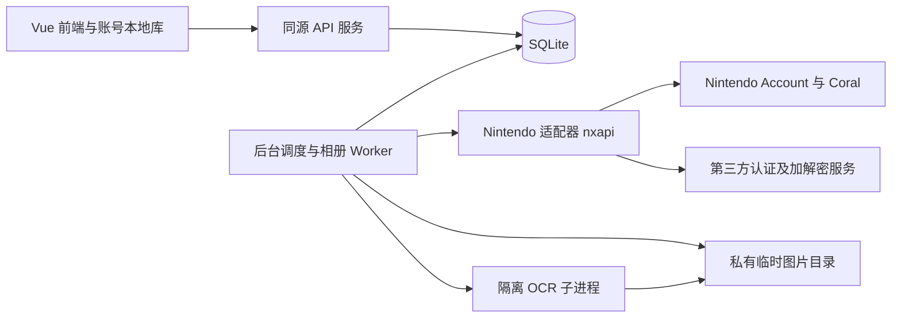

# Groove Archive · FP 成绩管理三期设计文档

> 版本：v3.0 草案  
> 调研日期：2026-09-29  
> 状态：方案设计，尚未实现或连接真实 Nintendo 账号验证  
> 目标：项目账号登录、多设备成绩同步、Nintendo 账号绑定、云端相册截图自动更新成绩

## 1. 结论与实施建议

建议保留现有 Vue 前端和离线能力，新增一个 Node.js / TypeScript 后端、一个 SQLite 数据库，以及独立运行的后台 worker。站内账号与 Nintendo 账号分开：站内账号拥有成绩，Nintendo 绑定只是可选的数据来源。

自动录入链路为：**Switch 2 截图上传至 Nintendo Switch App → 后端定期读取云端相册 → 筛选 GCFP 原图 → OCR → 校验及合并 → 各设备同步**。关闭网页后，服务器仍能继续处理。

优先使用 **nxapi 的 TypeScript 库作为 Nintendo 适配层**；参考 **NSO-Album-Sync** 的授权、下载校验和后台同步实现，不直接将桌面程序部署为多用户服务。这两个项目都不是 GCFP 成绩 API，相册只提供媒体，成绩仍需本项目识别。

三期拆为三个可独立验收的交付：

1. **3A：站内账号与成绩同步**，不依赖 Nintendo 服务
2. **3B：绑定 Nintendo、手动拉取相册及识别**，先打通真实链路
3. **3C：定时拉取、自动入库、待确认及故障恢复**，在真实截图验证后开启

正式排期前先完成第 13 节的技术验证。尤其不能先承诺“一键网页绑定”和“任意 Switch 均可自动读取相册”。

## 2. 已确认的能力与边界

### 2.1 主机与云端相册

任天堂官方说明：Switch 2 可将截图上传到 Nintendo Switch App，也可在主机相册设置中启用自动上传；云端每个 Nintendo Account 最多保存 100 个文件，上传内容保存 30 天，部分软件不支持上传。离线时可排队等待联网上传。[官方上传说明](https://www.nintendo.com/en-gb/Support/Troubleshooting/How-to-Upload-Screenshots-and-Videos-from-Nintendo-Switch-2-to-the-Nintendo-Switch-App-2843767.html)

由此确定产品边界：

| 场景 | 三期行为 |
| --- | --- |
| Switch 2、截图已出现在官方 App 相册 | 可尝试自动读取；GCFP 的真实截图上传和识别仍须验证 |
| 只保存在主机或存储卡、没有上传 | 服务器无法直接读取 |
| 原版 Switch / Lite / OLED | 不纳入本方案的云端相册自动读取承诺；继续导出截图后使用现有 OCR |
| 超过云端可见窗口、已过期的文件 | 无法通过这些接口补回，用户需重新上传或手动导入 |
| 上传到了其他 Nintendo 用户下 | 提示检查账号及主机上传用户，不能跨账号读取 |
| 视频、非 GCFP 图片 | 不下载视频、不识别无关游戏截图 |

轮询只能降低漏读概率，不能绕过云端容量和保留期。后台故障或短时间上传大量其他游戏内容，仍可能漏图；自动同步不作为主机相册完整备份。

### 2.2 两个项目的具体复用方式

本次按以下提交核查源码，实施时应固定通过验证的版本，不能把浮动 `main` 当作稳定接口：

| 项目 | 核查提交 | 能力与定位 |
| --- | --- | --- |
| [nxapi](https://github.com/samuelthomas2774/nxapi/tree/47c9d35d9d51d33e62dd6d3733b616e0ad31b02b) | `47c9d35d9d51d33e62dd6d3733b616e0ad31b02b` | TypeScript/JavaScript 库、CLI、桌面应用；可创建 Coral 会话、刷新认证、读取相册 |
| [NSO-Album-Sync](https://github.com/Dycool/NSO-Album-Sync/tree/4fc49154aa984b85e0c5d3f67a977021a81274b7) | `4fc49154aa984b85e0c5d3f67a977021a81274b7` | C++20 原生桌面托盘应用；授权、定期下载、文件归档与系统凭据存储，README 默认同步周期为 60 分钟 |

nxapi 的 `package.json` 在核查提交声明 `1.6.1`，这不证明 npm 同名版本已经包含该提交的全部改动。PoC 必须核对实际安装包是否具有相册与当前加密协议支持。[包声明](https://github.com/samuelthomas2774/nxapi/blob/47c9d35d9d51d33e62dd6d3733b616e0ad31b02b/package.json)

已核实的 nxapi 能力：

| 能力 | 源码 / 文档中的入口 | 接入注意 |
| --- | --- | --- |
| 初次认证 | `CoralApi.createWithSessionToken(...)` | 返回 `nso` 与认证 `data` |
| 恢复会话 | `CoralApi.createWithSavedToken(data)` | 保存并复用认证数据，不应每次轮询重新登录 |
| 续期 | `renewToken(...)` / `onTokenExpired` | 持久化更新后的凭据，以当前类型及返回值为准 |
| 相册列表 | `nso.getMedia()` | 底层调用 `/v4/Media/List`，库返回值中读取 `media` |
| CLI 验证 | `nxapi nso album --json` | 适合个人 PoC，不作为正式后端每次请求的子进程 |

依据：[Coral 库说明](https://github.com/samuelthomas2774/nxapi/blob/47c9d35d9d51d33e62dd6d3733b616e0ad31b02b/docs/lib/coral.md)、[Coral 实现](https://github.com/samuelthomas2774/nxapi/blob/47c9d35d9d51d33e62dd6d3733b616e0ad31b02b/src/api/coral.ts)、[相册 CLI](https://github.com/samuelthomas2774/nxapi/blob/47c9d35d9d51d33e62dd6d3733b616e0ad31b02b/src/cli/nso/album.ts)

相册媒体模型包含 `id`、`type`、`applicationId`、`appName`、`contentUri`、`contentLength`、`thumbnailUri`、`capturedAt`、`uploadedAt`、`expiresAt`。`type` 区分 `image` 和 `video`；缩略图类型注释为 320×180 JPEG，不能代替 OCR 原图。时间由适配层从上游秒统一转换为本项目毫秒。[媒体类型定义](https://github.com/samuelthomas2774/nxapi/blob/47c9d35d9d51d33e62dd6d3733b616e0ad31b02b/src/api/coral-types.ts#L513)

当前 `getMedia()` 没有暴露分页游标；虽然类型文件保留 `count: 100` 的参数声明，实际调用没有传该字段。NSO-Album-Sync 当前也发送空 `parameter`。设计为扫描当前可见集合，不虚构分页、历史回溯或服务端增量能力。[相册调用实现](https://github.com/Dycool/NSO-Album-Sync/blob/4fc49154aa984b85e0c5d3f67a977021a81274b7/src/coral.cpp#L661)

NSO-Album-Sync 值得参考的是：缓存凭据、校验下载地址与长度、临时文件完成后再改名、保留拍摄时间。其单用户状态、系统钥匙串和桌面回调不能直接套用到托管后端。[同步实现](https://github.com/Dycool/NSO-Album-Sync/blob/4fc49154aa984b85e0c5d3f67a977021a81274b7/src/sync.cpp)

### 2.3 外部认证依赖不是一个普通 Bearer API

当前源码包含第三方 `f` 生成，以及 Coral 请求加密和响应解密。NSO-Album-Sync 的 README 明确披露，相关服务会处理 Nintendo 身份信息、Coral token 和 API 请求/响应。不能只告诉用户“第三方收到一个临时签名参数”，也不能声称凭据始终只在本项目服务器内。[数据披露](https://github.com/Dycool/NSO-Album-Sync/blob/4fc49154aa984b85e0c5d3f67a977021a81274b7/README.md#-nintendo-account--nxapi)、[nxapi 加密请求实现](https://github.com/samuelthomas2774/nxapi/blob/47c9d35d9d51d33e62dd6d3733b616e0ad31b02b/src/api/coral.ts#L828)

nxapi 文档要求库调用者注册自己的 nxapi-auth client，常见作用域为 `ca:gf ca:er ca:dr`；该凭据属于本项目接入第三方认证服务的身份，与 Nintendo 客户端 ID、站内用户会话不同。不可复制其他应用的 client 身份或依赖其私人代理。[nxapi 认证说明](https://github.com/samuelthomas2774/nxapi#nxapi-auth-authentication)

NSO-Album-Sync 的当前 Coral 源码还存在作者部署的 Worker `f` 生成路径。它不是项目可直接依赖的公共服务承诺，采用 nxapi 适配层时不照搬这条私有部署依赖。[Coral 源码](https://github.com/Dycool/NSO-Album-Sync/blob/4fc49154aa984b85e0c5d3f67a977021a81274b7/src/coral.cpp)

这些是非官方接口，更新可能导致授权或拉取失效。Nintendo 故障只影响绑定和相册任务，站内登录、成绩同步和手动导入应继续可用。

### 2.4 许可证与调研可信度

nxapi 声明 `AGPL-3.0-or-later`，NSO-Album-Sync 为 MIT。正式采用前确定本项目源码发布方式、依赖分发和通知要求；不能因为把 nxapi 放进独立进程，就假定解决所有许可问题。这里记录依赖条件，不作具体法律适用结论。[nxapi 许可证](https://github.com/samuelthomas2774/nxapi/blob/47c9d35d9d51d33e62dd6d3733b616e0ad31b02b/LICENSE)、[NSO-Album-Sync 许可证](https://github.com/Dycool/NSO-Album-Sync/blob/4fc49154aa984b85e0c5d3f67a977021a81274b7/LICENSE)

按项目要求先使用 Context7 CLI 查询了两个项目，但返回的是无关库，没有可用索引，因此本节以固定提交的源码和任天堂官方资料为依据。已确认的是代码能力与产品边界；真实账号授权、服务额度、GCFP 的 application ID 和 Linux 后台 OCR 均未实测。

## 3. 与现有项目衔接

以 [二期设计](FP_B30_二期设计文档.md) 和当前代码为基线；本文件只扩展三期范围，不将二期待实现功能视为已完成。

| 现有模块 | 当前行为 | 三期调整 |
| --- | --- | --- |
| `src/db/database.ts` | 单个 Dexie 数据库，本地数字自增 ID | 区分游客库和账号库，增加 outbox、同步游标与服务端版本 |
| `src/db/scoreRepository.ts` | 本地增删改，OCR 高分合并 | 保留页面调用入口；本地成绩与待同步操作在同一事务写入 |
| `src/core/score/import.ts` | Excel 预览及事务合并 | 抽取共用合并规则，避免把云端导入硬编码为 `excel` |
| `src/core/ocr/parser.ts` | 字段解析、曲名匹配、页面及状态校验 | 复用纯业务部分，新增候选信息和待确认结果 |
| `src/core/ocr/recognizer.ts` | 浏览器 Worker、Canvas、ImageBitmap、WASM | 不能直接在 Node 中执行；通过独立服务端 OCR 适配器运行 |
| `src/core/rating/`、`src/core/song/` | 本地计算与稳定曲库 ID | 前后端共用规则与版本，服务端校验并重算派生字段 |
| `src/composables/useOcrImport.ts` | 页面任务取消、前台入库 | 保留本地截图入口，后台相册任务由服务器管理 |

继续遵守：Score 为 0～1,050,000 整数；FC / AP / Max Chain 可未知；AP 成立时 FC 成立；每用户每谱面一条当前成绩；BASIC / ADVANCED 独立 B30。只改 Max Chain 不改变业务 `updatedAt`，但必须触发同步版本变化。

现有 `rating` 为派生值，不能信任客户端上传结果。现有数字 `id` 仅用于设备内部，不作为跨设备主键。调研还发现 README 的 OCR 批量上限描述与当前 `MAX_IMPORT_FILES = 60` 不一致；三期后台限制单独定义，不从过时文案推导。

## 4. 范围与架构

### 4.1 最小部署



建议从一台常驻服务器起步：一个 API 进程、一个 worker 进程、一个持久化数据库卷和私有图片卷。静态前端与 `/api` 同源，减少跨域会话配置。初期不引入 Redis、消息中间件、微服务或 WebSocket。

SQLite 保存业务数据和任务队列，写事务保持短小，网络请求与 OCR 均在事务外执行。API 与 worker 对数据库的访问需要明确单机部署前提、忙等待和事务重试；多实例或持续写入压力出现后再迁移 PostgreSQL。数据库驱动及 HTTP 框架在 3A 开工时锁定版本，本文不依赖某个框架的特定 API。

后台调度从数据库读取到期任务，即使进程重启也能恢复。仅使用浏览器定时器不能满足关页后同步；仅使用一次性函数也不适合作为当前 OCR 长任务的默认宿主。

### 4.2 包含与不包含

三期包含账号登录、首次本地迁移、多设备同步、离线编辑、绑定/解绑、手动和定时同步、任务记录、待确认及错误提示。

好友、排行榜、完整游玩历史、任天堂相册备份、视频识别、服务端代操作主机不纳入。主题、语言等偏好首版继续设备本地保存。内部变更日志用于同步和纠错，不承诺为用户提供历史成绩产品。

## 5. 站内账号与设备隔离

### 5.1 登录方案

首版建议邮箱一次性验证码登录，省去密码找回和密码管理；邮箱服务是新增外部依赖，部署时配置发送服务和发信域名。若部署环境不适合邮件，3A 开工前替换为单一成熟身份提供方，成绩归属仍使用内部 `userId`，不与邮箱或第三方昵称绑定。

验证码仅存哈希，建议 10 分钟过期、一次有效、失败次数封顶；按邮箱和 IP 限制发送及验证频率，返回统一提示避免枚举账号。成功后发随机站内会话，数据库存会话摘要，浏览器使用 `HttpOnly + Secure + SameSite` Cookie。写请求校验 Origin 和 CSRF，账号切换及退出撤销当前会话。

站内会话、Nintendo 长期会话、Coral 短期凭据、nxapi-auth 应用凭据分开保存和命名。所有 API 从服务端会话确定 `userId`，不能信任请求体中用户自报的所有者。

### 5.2 游客迁移及退出

1. 首次登录先拉取云端快照，保留原游客数据
2. 若游客库有成绩，显示新增、可提升、同分补全、跳过数量，用户选择导入或暂不导入
3. 导入按第 7 节规则合并，整个迁移带唯一 `migrationId`，重复提交不能重复产生效果
4. 服务端确认后写入账号库；保留游客库作为迁移前副本，之后两者不自动双向同步
5. 退出后停止该账号的本地同步器并返回游客库；账号数据不作为游客数据显示

推荐每个账号独立 IndexedDB 命名空间，服务端 `userId` 映射只保存在站点本地；切换账号时先取消旧请求和订阅，晚到响应必须校验账号及会话代次。待同步操作始终绑定原账号，不能转发给下一个登录用户。退出时有未同步数据要提示并保留原账号队列；仅在用户明确选择后丢弃本机副本。

本地缓存清除与云端成绩清空拆成不同操作。清除本机缓存不会产生云端删除，云端清空需二次确认并走独立的同步协议。

## 6. 数据模型建议

以下是逻辑模型，不是已执行的数据库迁移。所有用户数据查询及唯一约束包含所有者；时间在 API 中统一用 UTC 毫秒。

| 表 | 关键字段和约束 |
| --- | --- |
| `users` | `id`、规范化唯一邮箱、创建时间、`datasetEpoch`、`nextChangeSeq` |
| `login_codes` / `sessions` | 验证码/会话摘要、过期时间、失败计数；会话绑定 `userId` |
| `scores` | `userId + chartId` 唯一，`songId`、score、nullable fc/ap/maxChain、source、createdAt、updatedAt、revision、deletedAt、autoImportBlocked；rating 可作版本化缓存 |
| `score_changes` | 用户内单调 `seq`、chartId、动作、规范结果、revision、epoch、服务端变更时间；按用户和 seq 索引 |
| `mutation_receipts` | `userId + mutationId` 唯一、请求摘要、处理结果；重复 ID 携带不同载荷拒绝 |
| `nintendo_bindings` | userId、Nintendo Account 标识、显示名、状态、同意版本、加密凭据、keyVersion、generation、下次轮询时间、最后成功时间 |
| `nintendo_auth_flows` | 随机 flowId、userId、state、加密 verifier、过期时间、消费状态；短期保存 |
| `album_items` | `userId + NintendoAccountId + mediaId` 唯一、applicationId、拍摄/上传/过期时间、私有文件引用、内容 hash、状态、识别版本、候选结果、错误码 |
| `jobs` | 任务类型、所属用户及绑定、generation、状态、nextRunAt、leaseUntil、attempts、幂等键；包含轮询与单图处理 |

`source` 扩充 `nso_ocr`，与 `manual / ocr / excel` 区分。JSON 明确用 `null` 表示未知，不能将 `false`、`0` 当空值。编辑 API 中字段缺失表示不修改，显式 `null` 表示清空，统一映射现有 TypeScript 可选字段。

三个时间概念分开：`capturedAt` 为上游拍摄时间，仅用于展示与辅助判断；`updatedAt` 维持现有业务语义；`seq/revision` 驱动同步。客户端时钟和拍摄时间都不能承担并发排序。

首版每站内账号只绑定一个 Nintendo Account；同一个 Nintendo Account 不同时绑定多个站内账号，以唯一约束落实。重新绑定同一个 Nintendo Account 复用媒体处理记录，避免全部重新导入。

## 7. 成绩同步与冲突规则

### 7.1 传输协议

采用本地 outbox + 服务端变更日志，传输“操作”而非整库覆盖。操作含 `mutationId`、`deviceId`、`datasetEpoch`、chartId、动作、`baseRevision` 和业务字段；服务端事务内校验、写成绩、递增 seq、写变更及回执。

本地成绩和 outbox 在同一 Dexie 事务写入。一次最多提交 100 条操作；服务端逐操作返回成功、冲突或校验失败，网络超时后用原 mutationId 重试。客户端先拉取变化更新已确认基线，再把待提交操作叠加为本地视图，不能因拉取覆盖未上传编辑。

拉取使用不透明 cursor，返回按 seq 排序的 upsert 和 tombstone；应用变更与保存 cursor 是同一事务。首次快照返回一致性快照及对应 cursor。游标失效时下载新快照，保留 outbox，按原版本重新校验，禁止上传旧快照覆盖服务器。

首版登录、恢复联网、窗口重新可见时同步，页面可见期间建议每 30 秒拉取一次，有本地写入则短暂合并后立即提交。该间隔是站内参数，与 Nintendo 相册轮询分开。

### 7.2 自动合并与显式编辑分开

| 操作 | 规则 |
| --- | --- |
| 本地 OCR、Excel、游客迁移、相册 OCR | 高分更新、低分跳过；同分只补未知信息；不把低分 FC/AP 套在高分上 |
| 手动新增已有谱面 | 延续当前提示，引导编辑；多设备并发新增返回冲突 |
| 手动编辑，包括降分和清空字段 | 必须匹配 `baseRevision`，降分还需明确确认；冲突时显示当前云端值和本机提案 |
| 删除 | 匹配 revision 后生成墓碑，不能物理删除后让离线旧设备重新插回 |
| 云端清空全部 | 事务递增 datasetEpoch，并更新同步状态；旧 epoch 的操作整体拒绝，不逐条复活 |

并发自动导入可在服务端重新比较最新值，但不能越过人工保护、删除墓碑或 datasetEpoch。两台设备同时手动修改不同字段，首版也走版本冲突确认，不实现复杂字段级合并。

例如：A 离线将成绩编辑为 990000，B 已在云端纠错为 980000。A 的旧 revision 必须进入冲突，不能以“更高分”为理由覆盖 B。反过来，两张可信自动截图分别为 980000 和 990000，则最终保留 990000。

### 7.3 防止旧截图恢复错误数据

仅做“保留最高分”会使 OCR 误识别的高分在用户纠正后重新出现，因此规定：

- 人工降分、纠正已知完成标记或删除时，给该谱面设置 `autoImportBlocked`；后续自动候选进入待确认，用户可明确解除保护
- 已处理或用户拒绝的 mediaId 持续记录；重新上传相同字节以每用户内容 hash 去重，hash 命中原人工拒绝记录时仍待确认
- 编辑后的不同图片可能绕过 hash，所以保护必须作用于谱面，不只作用于文件
- 云端清空成绩会暂停相册自动导入，保留媒体处理记录；用户重新开启时选择从当前可见列表建立基线，还是重新审核历史截图
- 任务在创建时保存 epoch 和 binding generation，最终写成绩时再次检查；清空、解绑或换账号后的旧任务不能提交

正常高分手动录入无需自动锁定所有后续成绩；界面单独提供“暂停此谱面自动更新”，方便用户主动控制。

同步日志、墓碑和回执首版不自动淘汰，先保正确性并监控体积。后续压缩时必须定义最旧有效游标、设备失效及强制快照流程，不能仅按日期删除墓碑。

## 8. Nintendo 绑定与令牌生命周期

### 8.1 网页绑定不是标准网站 OAuth 回调

两个项目使用 Nintendo 原生应用认证流程。已核查的客户端为 `71b963c1b7b6d119`，回调为 `npf71b963c1b7b6d119://auth`，授权结果是 `session_token_code`，并配合 state 与 S256 challenge。它不能直接替换成本站 HTTPS callback。[Nintendo 授权实现](https://github.com/Dycool/NSO-Album-Sync/blob/4fc49154aa984b85e0c5d3f67a977021a81274b7/src/nintendo_auth.cpp)

建议先在桌面浏览器提供引导式绑定：

1. 已登录用户阅读数据流说明，明确同意第三方认证/解密处理和服务器暂存截图
2. 后端创建 10 分钟有效、一次使用的 flow，保存 state 与 verifier，返回授权链接
3. 用户在 Nintendo 官网登录，本站不收集 Nintendo 密码
4. 通过经过实测的“复制最终回调链接”方式，把原生 scheme 回调粘贴回本站；作为请求体提交，禁止写入 URL 查询、访问日志或埋点
5. 后端严格检查 scheme、host、state、flow 所属会话和期限，换取 Nintendo session token，并获取真实账号身份
6. 使用 nxapi 建立 Coral 会话，确认账号未被其他站内用户绑定，显示昵称并完成绑定
7. 清除 flow，立即尝试一次只读相册检查，空相册也能绑定成功

这是待实测的交互方案，不是已证明所有浏览器可用。手机可能被官方 App 接管，浏览器也可能无法方便复制最终链接。若桌面复制回调无法稳定完成，3B 应采用专用本地授权助手与一次性配对码；助手只完成这次授权，把结果通过受限通道交给绑定 flow。不得退化为要求用户上传整个凭据文件或从其他软件提取长期 token。

移动端首版可显示“请在电脑完成首次绑定”；是否增加本地助手由 PoC 结果决定。不得以接入困难为由修改 Nintendo 的回调白名单或伪装已有 HTTPS 回调支持。

### 8.2 缓存、续期与停止

Nintendo session token 用于重建短期会话；Coral 凭据缓存有效期按返回 `expiresIn` 计算，不写死“永久有效”或“每两小时登录”。nxapi-auth 应用凭据单独管理，尊重其服务端限制。

每个绑定只允许一个刷新操作；同一账号的任务复用结果。确认为 token 过期时仅尝试一次刷新再重放请求；上游 HTTP 成功但业务错误仍按失败处理。长期凭据失效进入 `reauth_required`，停止定时请求并提示重新绑定，不能无限重新登录。

绑定状态建议：`active / paused / reauth_required / error / unbound`。页面退出登录不停止已授权后台同步；“暂停同步”和“解绑”才停止后续任务，界面明确这一区别。

解绑事务先递增 generation、关闭调度，再删除可用凭据并取消任务。已下载文件清理，已导入成绩保留。停止使用本地凭据不等同于替用户撤销 Nintendo 侧所有授权，界面避免作此承诺。

## 9. 相册扫描、去重及 OCR

### 9.1 调度与下载

建议默认每 30 分钟扫描一次，加随机抖动；用户可手动同步，单账号手动触发建议至少间隔 60 秒。它们是初始配置，不是上游保证可接受的额度；真实限流结果和服务条款优先。

任务流程：

1. 领取持久化 lease，确认账号状态、epoch、generation
2. 恢复凭据并读取当前完整媒体列表
3. 按 `applicationId` 白名单过滤 GCFP，只接受 `image`
4. 对未见过的 mediaId 建立处理项；优先下载即将过期的内容，不能只按 `capturedAt > 上次时间` 判断新图
5. 下载 `contentUri` 原图，验证类型、长度、像素和 hash，再排入 OCR
6. OCR 输出结构化候选，执行第 7 节事务规则，保存结果和同步变更

GCFP 的 applicationId 尚未验证，不在设计中编造值。PoC 从自己的真实相册返回值确认，按地区/发行版本维护允许集合；`appName` 仅作显示与诊断，不用模糊名称匹配自动入库。白名单未覆盖时显示“不支持的游戏版本”，不得悄悄下载全部相册尝试识别。

首次绑定默认处理云端当前可见的 GCFP 截图，并预先说明范围。以后每次仍检查整个可见列表，通过数据库唯一键去重；不能只记录最大 mediaId 或最近拍摄时间，因为旧截图可能晚上传。

文件下载限制建议沿用现有图片入口的 20 MiB 和约 1600 万像素边界；接收流中强制上限，不能只相信 `contentLength`。仅允许经验证的 Nintendo 媒体 HTTPS 主机，阻止内网地址、危险重定向和路径穿越；允许域名清单在 PoC 收集后固定。带签名的 URL 不返回前端、不进日志；过期时重新拉列表获取新 URL，仍不存在则标记 `expired`。

### 9.2 OCR 运行方式

现有识别器依赖 DOM、Canvas、Worker 和 `import.meta.env`，不能简单搬到 Node 中调用。建议分两层：共享 `OcrFields → Recognition` 的业务解析与评分规则；推理、解码及 ROI 裁剪由运行环境适配器承担。

首版优先验证**服务端无头 Chromium 运行专用 OCR 页面**：利用已有浏览器 OCR 及 Playwright 测试经验，最大程度复用现有模型、日文识别和 ROI。页面只提供图片到识别结果的函数，不加载账号 UI，不写 IndexedDB，不持有 Nintendo token；与 API 进程隔离，禁用任意外部导航，仅访问本地模型资源。生产部署需显式安装所选浏览器和系统依赖，不能依赖开发机的 Edge。

这会增加浏览器运行时和内存成本，但能先验证业务闭环。若压测或稳定性不达标，再评估原生 OCR 服务；更换引擎需用相同样本重新验证，不能假设同名 PaddleOCR 的模型和字段结果完全一致。服务端调用方式属于待实现方案，本次没有验证 Linux 运行环境。

模型随部署预置，worker 启动预热；初期 OCR 并发 1，每图设置超时，超时销毁并重建推理实例。下载和推理分开排队，避免慢 OCR 导致即将过期的原图来不及下载。API 进程不承担推理。

### 9.3 自动入库判定

现有解析器只有 score / skipped 或异常，没有经验证的整体置信度；不能把模型阈值 `0.65` 或曲名匹配分数当作“成绩可信概率”。新增 evidence，保留页面类型、关键区域原始文本、候选曲目、匹配方式和校验原因。

自动入库至少要求游戏白名单匹配、支持的完整页面、唯一谱面、合法分数及完成标记、无人工保护。非唯一曲名、疑似数字替换、关键字段冲突、未知谱面、疑似异常高分进入 `needs_review`，不得用提升 B30 的幅度证明正确。

3B 初期全部先预览确认；使用真实相册下载样本验证后，3C 才允许用户开启严格规则下的自动写入。未知信息仍为未知，不为通过校验补 `false` 或 `0`。MISSION CLEAR / MISSON CLEAR、游玩中和未游玩占位继续跳过。

`album_items` 的状态建议为 `discovered → downloaded → recognizing → imported / skipped / needs_review`，另有 `retry_wait / failed / expired / canceled`。成绩写入和 imported 状态更新须在同一事务；进程在任意节点崩溃，重放都不能再次更新业务时间。

### 9.4 图片保留与待确认

建议成功和确定跳过的原图处理后尽快删除，最迟 24 小时；待确认或可重试图片保留 7 天后删除，识别文本、状态和去重标识继续保留。文件清理由独立周期任务兜底，进程崩溃也不能永久遗留。

待确认列表显示曲名候选、分数、原因、原图有效期，支持确认、改正、拒绝。确认时重新读取最新成绩，不使用列表打开时的旧版本。原图已清理时明确提示，允许用户重新上传，不能显示失效的上游直链。

以上期限是本项目提议，可按部署容量调整；与任天堂的云端保存期限是两回事。首次开启自动同步前说明服务器会暂存截图，本地手动 OCR 入口仍保持浏览器内处理。

## 10. API 与页面设计

以下路径属于本项目拟定接口，不是 nxapi 或任天堂提供的接口。

| 方法与路径 | 用途 |
| --- | --- |
| `POST /api/auth/code`、`POST /api/auth/verify` | 发验证码、验证并创建站内会话 |
| `GET /api/me`、`POST /api/auth/logout` | 当前账号与退出 |
| `GET /api/sync/snapshot` | 一致性成绩快照、版本和 cursor |
| `GET /api/sync/changes?cursor=...` | 按用户读取增量，包含删除 |
| `POST /api/sync/mutations` | 批量提交有幂等 ID 的成绩操作 |
| `POST /api/scores/reset` | 带当前 epoch 和确认标记清空云端成绩 |
| `POST /api/nintendo/auth/start` | 创建绑定 flow，要求已记录同意版本 |
| `POST /api/nintendo/auth/complete` | 提交 flowId 与回调内容，检查 state 后完成绑定 |
| `GET /api/nintendo/binding` | 返回显示名、状态、最后成功/下次同步时间，不返回凭据 |
| `PATCH /api/nintendo/binding`、`DELETE /api/nintendo/binding` | 暂停/恢复和解绑 |
| `POST /api/nintendo/sync` | 幂等创建任务并返回 202 / jobId |
| `GET /api/import-jobs`、`GET /api/import-jobs/:id` | 任务状态与统计 |
| `GET /api/album-items?status=needs_review` | 待确认列表 |
| `POST /api/album-items/:id/resolve` | 确认、改正或拒绝，包含幂等 ID 和候选版本 |

所有资源 ID 都要检查所属用户。过期 cursor 返回明确的重建快照错误；手动编辑冲突返回 `409` 和当前规范记录；用户频率限制返回 `429` 及重试时间。后台内部错误脱敏，前端不显示上游原始响应。

设置页新增“账号与云同步”和“Nintendo 相册”两个区域：前者显示本地待同步数、最近同步时间、冲突和重试；后者显示绑定昵称、自动同步开关、立即同步、最近结果、重新授权和解绑。两种同步状态不能共用一个模糊的“同步失败”。

首页保留截图/Excel 上传；账号启用后提示这些成绩会同步到云端。成绩详情显示来源和是否自动更新受保护；任务记录区分读取失败、下载失败、识别失败、低分跳过和需要用户确认。

## 11. 故障恢复、安全与运维

### 11.1 任务恢复

| 情况 | 处理 |
| --- | --- |
| 网络超时或 5xx | 建议按 1、5、15、60 分钟退避并加抖动，持久化 nextRunAt |
| 429 | 尊重 Retry-After；应用级配额耗尽时暂停所有相关绑定，避免每用户分别重试 |
| Coral 凭据过期 | 单次刷新并重试，长期凭据失效则要求重新绑定 |
| OCR 超时/进程崩溃 | 终止推理实例，有限重试该图片，不重做已成功图片 |
| 上游返回结构变化 | 校验失败并停止本轮，显示服务异常，不能误当空相册成功 |
| worker 重启 | 回收超时 lease，从数据库恢复；唯一键和回执保证重放安全 |
| 用户解绑/清空 | 最终提交前校验 generation/epoch，拒绝旧任务写入 |

每绑定最多一个相册扫描，每张图片最多一个处理任务。任务领取、续租、完成都校验 lease 所有者；worker 失去 lease 后不能提交。设置全局下载和 OCR 并发，避免用户数增加时同时触发上游认证。

### 11.2 凭据与数据保护

Nintendo 和 Coral 凭据使用有认证的加密方式加密存储，保存 keyVersion；主密钥通过部署 secret 提供，不能与数据库备份放在同一位置。轮换密钥需要兼容旧密文读取和重新加密。

生产关闭上游详细认证日志，对授权码、Cookie、token、带签名 URL、生日等字段统一脱敏。worker 只把图片字节交给 OCR 进程，不把绑定凭据注入浏览器；私有文件只通过鉴权接口短期读取。

用户可以导出成绩、解绑和删除账号；删除账号先停止任务和撤销会话，再清理成绩、凭据和临时图片。备份中的数据按明确的保留周期到期清除，不能承诺点击后所有历史备份瞬间删除。

### 11.3 容量与观测

以单机小规模试用为假设，不预先承诺最低硬件或固定费用。PoC 实测冷启动、单图耗时、浏览器常驻内存和峰值内存，再决定实例规格。

默认 30 分钟轮询时，每个活跃绑定每天约 48 次相册请求；100 个绑定约 4800 次。这还不含认证和第三方加解密请求，不能把它当作第三方配额评估的全部请求量。最终周期应结合上游许可额度、图片产生速度和实际负载调整。

记录任务等待时间、最近成功扫描、下载/OCR耗时、入库/跳过/待确认数、续期失败率、429 和图片目录体积。日志使用内部 jobId，避免直接输出 Nintendo 身份标识。

每日做数据库一致性备份，不能在活跃写入时只复制单个主文件；包含必要配置，密钥单独保管。建议先设 7 天备份保留并演练一次恢复；任务从数据库恢复，短期图片丢失需明确重下或重传。数据库迁移前备份，保留应用回滚和停止自动写入的开关。

## 12. 建议改动目录

```text
server/
  auth/                 站内登录与会话
  db/                   表结构、迁移与事务
  scores/               同步协议与成绩写入
  nintendo/             nxapi 适配器及绑定生命周期
  jobs/                 调度、租约、重试
  ocr/                  OCR 进程适配及专用运行页面
shared/
  score/                共用校验和合并规则
  rating/               共用评分规则
  song/                 曲库查询和版本
src/
  core/sync/            outbox 推送、增量拉取与冲突
  composables/          账号和同步状态
  pages/                设置与导入记录界面
```

先抽离少量真正共用的业务规则，不为三期整体重写前端。共用模块不能导入 Dexie、DOM 或后端数据库驱动；前端、API 和 OCR 随同一曲库及规则版本部署，收到不兼容版本时提示更新，不能静默丢弃未知谱面。

## 13. 技术验证、交付顺序与验收

### 13.1 开发前验证门槛

| 验证 | 通过标准 | 不通过时 |
| --- | --- | --- |
| 真实设备链路 | GCFP 原图在官方 App 可见，并被相册 API 返回；记录 applicationId、页面尺寸和时间单位 | 3A 继续，自动相册功能不开放 |
| 当前认证服务 | 用自己的 nxapi-auth client 完成授权、加密列表读取和 token 续期 | 排查上游接入条件，不复制他人凭据 |
| 网页绑定 | 桌面至少一个目标浏览器可完成复制回调；错误 state/过期/replay 均拒绝 | 采用受限本地授权助手，调整绑定说明 |
| 后台 OCR | Linux 环境用相册原图跑通既有有效/跳过样本及新尺寸，记录资源消耗 | 更换推理适配器或暂缓 3C |
| 凭据持久化 | 重启服务后仍能恢复会话，过期时正确续期 | 不进入定时运行阶段 |
| 许可与服务接入 | 明确代码发布方式、依赖通知及第三方服务使用条件 | 决定其他适配方式，3A 独立交付 |

既有 21 张 OCR 样本只能作为回归基线，还需补充云端下载后的真实 GCFP 结算页、选曲页、压缩图、多语言标题及非目标图片。不能用仓库有接口证明自己的账号和部署环境已经可用。

### 13.2 交付里程碑

| 阶段 | 实现内容 | 完成标准 |
| --- | --- | --- |
| 3A | 登录、账号隔离、数据模型、游客迁移、增量同步和冲突处理 | 两台设备和离线编辑验证通过，删除/清空不会复活 |
| 3B | Nintendo 适配器、引导绑定、立即同步、下载/OCR、预览确认 | 真实截图成功识别入库并同步到另一设备，重跑不重复 |
| 3C | 周期调度、严格自动入库、人工保护、待确认、退避和运维 | 关闭网页后仍可更新，重启/解绑/失效场景可恢复或正确停止 |

不以未经验证的固定人日承诺排期。3A 可以在外部服务验证受阻时独立推进；3B 的授权交互与 OCR 运行环境是主要不确定项。

### 13.3 必须覆盖的验收场景

- 两个站内账号的数据、任务、图片、绑定状态严格隔离；跨用户读取资源被拒绝
- 首次游客导入预览与实际写入一致；超时重试、刷新、双击不会重复导入
- A/B 设备并发提高成绩保留高分；手动降分、同分标记冲突按 revision 处理
- 只改 Max Chain 能传播到另一设备，业务更新时间不变
- 删除后旧设备上线不复活；清空后旧 outbox、旧 OCR 任务不能恢复成绩
- A 退出后切到 B，A 的晚到响应和离线队列不能写入 B
- 重复 mediaId、同图重传、截图延迟上传、列表乱序均按规则处理
- 高分误识别被人工纠正后，旧图和后续候选不能再次自动覆盖
- 非 GCFP、视频、MISSION CLEAR、游玩中、未游玩占位均不产生成绩
- 无图、原图已过期、URL 失效、长度不符、超大图、错误格式均有独立结果
- 绑定回调 state 错误、过期、跨站内账号和重放被拒绝；凭据不进入日志
- 一次续期成功恢复；续期失败停止轮询；429 退避在重启后仍生效
- 下载中、OCR 中、提交前解绑均不会继续写成绩；重新绑定不会重复处理全部旧图
- 关闭所有网页，定时任务仍工作；worker 强制退出后不丢任务、不重复入库
- 备份恢复后可登录、拉取成绩，并正确恢复或停止后台任务

本次交付只有设计文档与阅读入口，没有新增后端、绑定账号、调用个人相册或执行生产部署。后续实现以真实链路验证结果补充本文件，并将“建议参数”更新为实测配置。
